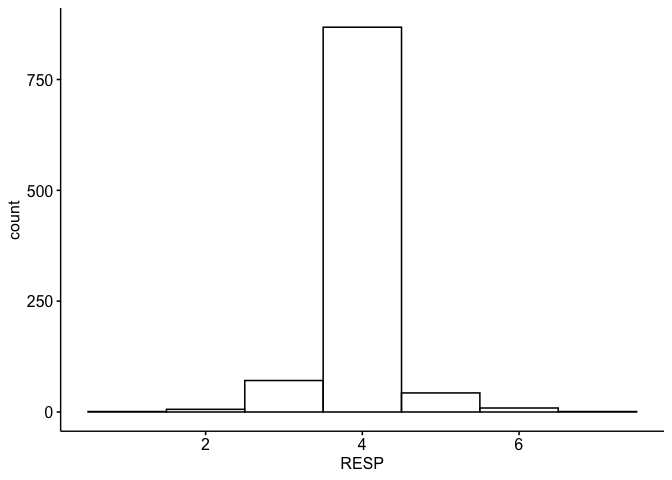
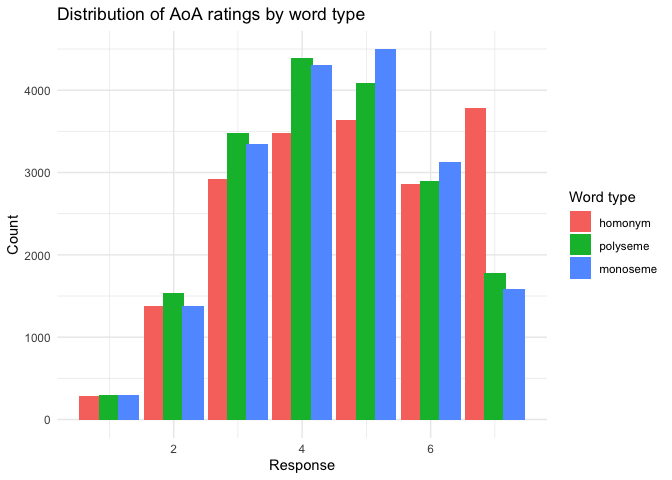
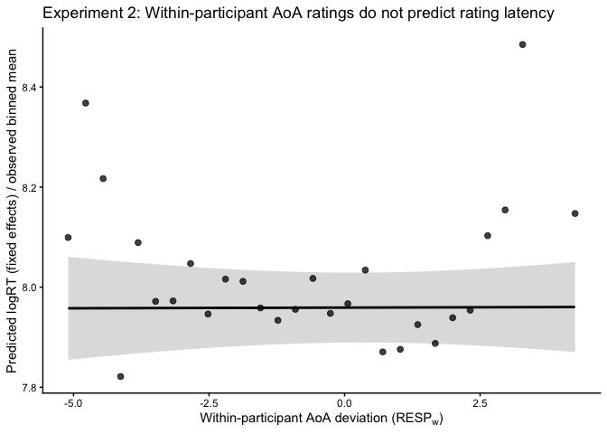

Chinese homonym meaning-level AoA analysis
================

## Libraries

``` r
# Load necessary libraries
library(ggplot2)
library(dplyr)
library(tidyr)
library(readr)
library(readxl)
library(purrr)
library(stringr)
library(tidyverse)
library(arrow)
library(rstatix)
library(emmeans)
library(ggpubr)
library(ez)
library(xtable)
library(lme4)
library(lmerTest)
library(ggstatsplot)
library(ggsci)
library(patchwork)
```

## Experiment 1: Data screening and preprocessing (rating RT)

``` r
# set working directory to project folder (update as needed)
setwd("~/Documents/meaning-specific-AoA-of-562-Chinese-homonyms/data")

# Load data
df_all <- read_csv("Exp1rating_HPM_data.csv")  

# remove NA rows in Stimulus_RESP and Explist, and convert Stimulus_RESP and Stimulus_RT to numeric
df_all <- df_all %>%
  filter(!is.na(Explist)) %>%
  filter(!is.na(Stimulus_RESP)) %>%
  mutate(RESP = as.numeric(Stimulus_RESP)) %>%
  mutate(RT = as.numeric(Stimulus_RT))
```

### Data screening: remove extremely fast responses (RT \< 500 ms)

``` r
# report the number and percentage of RT values that is less than 500 ms for each subject
Less500RT = df_all %>%
  group_by(Subject) %>%
  summarize(count_fast_RT = sum(RT < 500, na.rm = TRUE),
             total_RT = n(),
             pct_fast_RT = (count_fast_RT / total_RT) * 100,
             .groups = "drop") %>%
  arrange(desc(pct_fast_RT)) %>%
  print()
```

    ## # A tibble: 60 × 4
    ##    Subject count_fast_RT total_RT pct_fast_RT
    ##      <dbl>         <int>    <int>       <dbl>
    ##  1      35           481      999      48.1  
    ##  2      38            15      999       1.50 
    ##  3      27            13      999       1.30 
    ##  4      32             4      999       0.400
    ##  5      14             3      999       0.300
    ##  6      15             3      999       0.300
    ##  7      58             3      999       0.300
    ##  8      13             2      999       0.200
    ##  9      29             2      999       0.200
    ## 10       1             0      512       0    
    ## # ℹ 50 more rows

``` r
# define Subject is subj
subj <- 35

gghistogram(df_all %>% filter(Subject== subj), x="RESP", bins=7)
```

<!-- -->

``` r
# report the mean RT for each response for subj
df_all %>%
  filter(Subject == subj) %>%
  group_by(RESP) %>%
  summarize(mean_RT = mean(RT, na.rm = TRUE), .groups = "drop") %>%
  print()
```

    ## # A tibble: 7 × 2
    ##    RESP mean_RT
    ##   <dbl>   <dbl>
    ## 1     1   1901 
    ## 2     2   2148.
    ## 3     3   1179.
    ## 4     4    640.
    ## 5     5   1156.
    ## 6     6   1987.
    ## 7     7   1424

``` r
# remove subject 35 for further analysis
df_all <- df_all %>% filter(Subject != 35)
```

Subject 35 appears to press button 4 immediately. We remove this subject
from the analysis.

### Data screening: remove RT outliers

We compute subject-specific median and median absolute deviation, then
flag the reaction time as outliers if
`abs(logRT - sbj_logRT_median) > 2.5 * sbj_mad(logRT)`, following the
guidelines in Leys et al. (2013).

> Leys, C., Ley, C., Klein, O., Bernard, P., & Licata, L. (2013).
> Detecting outliers: Do not use standard deviation around the mean, use
> absolute deviation around the median. Journal of Experimental Social
> Psychology, 49(4), 764–766.
> <https://doi.org/10.1016/j.jesp.2013.03.013>

``` r
# For each participant, a trial was flagged as an outlier if |logRT - median(logRT)| > 2.5 × MAD(logRT)
df_all <- df_all %>%
  group_by(Subject) %>%
  mutate(
    logRT = log(RT),
    sbj_logRT_median = median(logRT, na.rm = TRUE),
    sbj_mad = mad(logRT, na.rm = TRUE),
    RT_outlier = abs(logRT - sbj_logRT_median) > 2.5 * sbj_mad
  ) %>%
  ungroup()

# reprot the percentage of rows removed as outliers for each subject
outlier_percentage <- df_all %>%
  group_by(Subject) %>%
  summarize(
    total_rows = n(),
    outliers_removed = sum(RT_outlier, na.rm = TRUE),
    outlier_pct = (outliers_removed / total_rows) * 100,
    .groups = "drop"
  ) %>%
  filter(outliers_removed > 0) %>%
  arrange(desc(outlier_pct))
print(outlier_percentage)  
```

    ## # A tibble: 58 × 4
    ##    Subject total_rows outliers_removed outlier_pct
    ##      <dbl>      <int>            <int>       <dbl>
    ##  1      20        999               54        5.41
    ##  2      27        999               52        5.21
    ##  3      45        999               49        4.90
    ##  4      12        999               44        4.40
    ##  5       7        999               43        4.30
    ##  6      29        999               43        4.30
    ##  7      15        999               35        3.50
    ##  8      59        999               33        3.30
    ##  9      37        999               32        3.20
    ## 10      52        999               32        3.20
    ## # ℹ 48 more rows

``` r
# report the number and percentage of outliers removed
total_rows <- nrow(df_all)
outliers_removed <- sum(df_all$RT_outlier)
outlier_pct <- (outliers_removed / total_rows) * 100
message(glue::glue("Total rows: {total_rows}, Outliers removed: {outliers_removed}, Percentage of outliers removed: {round(outlier_pct, 2)}%"))
```

    ## Total rows: 56503, Outliers removed: 1157, Percentage of outliers removed: 2.05%

``` r
# report the number and percentage of outliers for each word type
outlier_type <-df_all %>%
  group_by(word_type) %>%
  summarise(
    n = n(),
    out_n = sum(RT_outlier == 1, na.rm = TRUE),
    out_pct = 100*out_n/n
  )
print(outlier_type)
```

    ## # A tibble: 3 × 4
    ##   word_type     n out_n out_pct
    ##       <dbl> <int> <int>   <dbl>
    ## 1         1 18839   476    2.53
    ## 2         2 18835   379    2.01
    ## 3         3 18829   302    1.60

``` r
# Remove outliers
df_HPM <- df_all %>%
  filter(!RT_outlier)

# reprot the number of rows after outlier removal
print(glue::glue("Rows after removing RT outliers: {nrow(df_HPM)}"))
```

    ## Rows after removing RT outliers: 55346

### statistics on outliers by word type

Since word type may affect the likelihood of outliers, we fit a
mixed-effects logistic regression model to examine the effect of word
type on the probability of a trial being an outlier, with random
intercepts for subjects and items.

``` r
# convert word_type, item_id, Subject to factor if not already
if (!is.factor(df_all$word_type)) {
  df_all <- df_all %>%
    mutate(word_type = factor(word_type, levels = c("1","2","3"), labels = c("homonym", "polyseme", "monoseme")))
}
if (!is.factor(df_all$item_id)) {
  df_all <- df_all %>%
    mutate(item_id = factor(item_id))
}
if (!is.factor(df_all$Subject)) {
  df_all <- df_all %>%
    mutate(Subject = factor(Subject))
}
# convert RT, RESP, Explist to numeric if it is not already
if (!is.numeric(df_all$RT)) {
  df_all <- df_all %>%
    mutate(RT = as.numeric(as.character(RT)))
}
if (!is.numeric(df_all$RESP)) {
  df_all <- df_all %>%
    mutate(RESP = as.numeric(as.character(RESP)))
}
if (!is.numeric(df_all$Explist)) {
  df_all <- df_all %>%
    mutate(Explist = as.numeric(as.character(Explist)))
}

m_out_ri <- glmer(
  RT_outlier ~ word_type + (1 | Subject) + (1 | item_id),
  data = df_all,
  family = binomial,
  control = glmerControl(optimizer = "bobyqa")
)
summary(m_out_ri)
```

    ## Generalized linear mixed model fit by maximum likelihood (Laplace
    ##   Approximation) [glmerMod]
    ##  Family: binomial  ( logit )
    ## Formula: RT_outlier ~ word_type + (1 | Subject) + (1 | item_id)
    ##    Data: df_all
    ## Control: glmerControl(optimizer = "bobyqa")
    ## 
    ##       AIC       BIC    logLik -2*log(L)  df.resid 
    ##   10928.8   10973.5   -5459.4   10918.8     56498 
    ## 
    ## Scaled residuals: 
    ##     Min      1Q  Median      3Q     Max 
    ## -0.4992 -0.1610 -0.1310 -0.1001 14.5293 
    ## 
    ## Random effects:
    ##  Groups  Name        Variance Std.Dev.
    ##  item_id (Intercept) 0.2322   0.4819  
    ##  Subject (Intercept) 0.4551   0.6746  
    ## Number of obs: 56503, groups:  item_id, 999; Subject, 59
    ## 
    ## Fixed effects:
    ##                   Estimate Std. Error z value Pr(>|z|)    
    ## (Intercept)       -3.97234    0.10487 -37.880  < 2e-16 ***
    ## word_typepolyseme -0.22715    0.07999  -2.840  0.00452 ** 
    ## word_typemonoseme -0.45992    0.08420  -5.463 4.69e-08 ***
    ## ---
    ## Signif. codes:  0 '***' 0.001 '**' 0.01 '*' 0.05 '.' 0.1 ' ' 1
    ## 
    ## Correlation of Fixed Effects:
    ##             (Intr) wrd_typp
    ## wrd_typplys -0.349         
    ## wrd_typmnsm -0.331  0.435

``` r
emmeans(m_out_ri, ~ word_type, type="response")
```

    ##  word_type   prob      SE  df asymp.LCL asymp.UCL
    ##  homonym   0.0185 0.00190 Inf   0.01510    0.0226
    ##  polyseme  0.0148 0.00156 Inf   0.01201    0.0182
    ##  monoseme  0.0117 0.00128 Inf   0.00948    0.0146
    ## 
    ## Confidence level used: 0.95 
    ## Intervals are back-transformed from the logit scale

## Experiment 1: AoA ratings by word type

``` r
# convert word_type, item_id, Subject to factor if not already
if (!is.factor(df_HPM$word_type)) {
  df_HPM <- df_HPM %>%
    mutate(word_type = factor(word_type, levels = c("1","2","3"), labels = c("homonym", "polyseme", "monoseme")))
}
if (!is.factor(df_HPM$item_id)) {
  df_HPM <- df_HPM %>%
    mutate(item_id = factor(item_id))
}
if (!is.factor(df_HPM$Subject)) {
  df_HPM <- df_HPM %>%
    mutate(Subject = factor(Subject))
}
# convert RT, RESP, Explist to numeric if it is not already
if (!is.numeric(df_HPM$RT)) {
  df_HPM <- df_HPM %>%
    mutate(RT = as.numeric(as.character(RT)))
}
if (!is.numeric(df_HPM$RESP)) {
  df_HPM <- df_HPM %>%
    mutate(RESP = as.numeric(as.character(RESP)))
}
if (!is.numeric(df_HPM$Explist)) {
  df_HPM <- df_HPM %>%
    mutate(Explist = as.numeric(as.character(Explist)))
}
```

``` r
# Main LMM for with outlier removal
m1 <- lmer(RESP ~ word_type + (1 + word_type | Subject) + (1 | item_id),
           data = df_HPM,
           control = lmerControl(optimizer = "bobyqa"))
summary(m1)
```

    ## Linear mixed model fit by REML. t-tests use Satterthwaite's method [
    ## lmerModLmerTest]
    ## Formula: RESP ~ word_type + (1 + word_type | Subject) + (1 | item_id)
    ##    Data: df_HPM
    ## Control: lmerControl(optimizer = "bobyqa")
    ## 
    ## REML criterion at convergence: 160802.8
    ## 
    ## Scaled residuals: 
    ##     Min      1Q  Median      3Q     Max 
    ## -4.6825 -0.6338  0.0004  0.6433  5.5766 
    ## 
    ## Random effects:
    ##  Groups   Name              Variance Std.Dev. Corr       
    ##  item_id  (Intercept)       0.83669  0.9147              
    ##  Subject  (Intercept)       0.48153  0.6939              
    ##           word_typepolyseme 0.01976  0.1406    0.15      
    ##           word_typemonoseme 0.04630  0.2152   -0.03  0.74
    ##  Residual                   0.98791  0.9939              
    ## Number of obs: 55346, groups:  item_id, 999; Subject, 59
    ## 
    ## Fixed effects:
    ##                     Estimate Std. Error         df t value Pr(>|t|)    
    ## (Intercept)          4.79004    0.10358   98.34087  46.243  < 2e-16 ***
    ## word_typepolyseme   -0.34895    0.07396 1002.80606  -4.718 2.71e-06 ***
    ## word_typemonoseme   -0.31492    0.07694  874.73879  -4.093 4.66e-05 ***
    ## ---
    ## Signif. codes:  0 '***' 0.001 '**' 0.01 '*' 0.05 '.' 0.1 ' ' 1
    ## 
    ## Correlation of Fixed Effects:
    ##             (Intr) wrd_typp
    ## wrd_typplys -0.303         
    ## wrd_typmnsm -0.332  0.518

``` r
emmeans(m1, pairwise ~ word_type, adjust = "holm")
```

    ## $emmeans
    ##  word_type emmean    SE  df asymp.LCL asymp.UCL
    ##  homonym     4.79 0.104 Inf      4.59      4.99
    ##  polyseme    4.44 0.107 Inf      4.23      4.65
    ##  monoseme    4.48 0.107 Inf      4.27      4.68
    ## 
    ## Degrees-of-freedom method: asymptotic 
    ## Confidence level used: 0.95 
    ## 
    ## $contrasts
    ##  contrast            estimate     SE  df z.ratio p.value
    ##  homonym - polyseme     0.349 0.0740 Inf   4.718 <0.0001
    ##  homonym - monoseme     0.315 0.0769 Inf   4.093 <0.0001
    ##  polyseme - monoseme   -0.034 0.0741 Inf  -0.459  0.6461
    ## 
    ## Degrees-of-freedom method: asymptotic 
    ## P value adjustment: holm method for 3 tests

``` r
# Main LMM without outlier removal
m2 <- lmer(RESP ~ word_type + (1 + word_type | Subject) + (1 | item_id),
           data = df_all,
           control = lmerControl(optimizer = "bobyqa"))
summary(m2)
```

    ## Linear mixed model fit by REML. t-tests use Satterthwaite's method [
    ## lmerModLmerTest]
    ## Formula: RESP ~ word_type + (1 + word_type | Subject) + (1 | item_id)
    ##    Data: df_all
    ## Control: lmerControl(optimizer = "bobyqa")
    ## 
    ## REML criterion at convergence: 164392.1
    ## 
    ## Scaled residuals: 
    ##     Min      1Q  Median      3Q     Max 
    ## -4.6727 -0.6337  0.0012  0.6437  5.5386 
    ## 
    ## Random effects:
    ##  Groups   Name              Variance Std.Dev. Corr       
    ##  item_id  (Intercept)       0.83247  0.9124              
    ##  Subject  (Intercept)       0.47670  0.6904              
    ##           word_typepolyseme 0.01829  0.1352    0.17      
    ##           word_typemonoseme 0.04526  0.2127   -0.01  0.74
    ##  Residual                   0.99338  0.9967              
    ## Number of obs: 56503, groups:  item_id, 999; Subject, 59
    ## 
    ## Fixed effects:
    ##                     Estimate Std. Error         df t value Pr(>|t|)    
    ## (Intercept)          4.79807    0.10312   98.56964   46.53  < 2e-16 ***
    ## word_typepolyseme   -0.35259    0.07360 1006.39452   -4.79 1.91e-06 ***
    ## word_typemonoseme   -0.31966    0.07665  880.60860   -4.17 3.34e-05 ***
    ## ---
    ## Signif. codes:  0 '***' 0.001 '**' 0.01 '*' 0.05 '.' 0.1 ' ' 1
    ## 
    ## Correlation of Fixed Effects:
    ##             (Intr) wrd_typp
    ## wrd_typplys -0.302         
    ## wrd_typmnsm -0.327  0.516

``` r
emmeans(m2, pairwise ~ word_type, adjust = "holm")
```

    ## $emmeans
    ##  word_type emmean    SE  df asymp.LCL asymp.UCL
    ##  homonym     4.80 0.103 Inf      4.60      5.00
    ##  polyseme    4.45 0.107 Inf      4.24      4.66
    ##  monoseme    4.48 0.106 Inf      4.27      4.69
    ## 
    ## Degrees-of-freedom method: asymptotic 
    ## Confidence level used: 0.95 
    ## 
    ## $contrasts
    ##  contrast            estimate     SE  df z.ratio p.value
    ##  homonym - polyseme    0.3526 0.0736 Inf   4.790 <0.0001
    ##  homonym - monoseme    0.3197 0.0767 Inf   4.170 <0.0001
    ##  polyseme - monoseme  -0.0329 0.0739 Inf  -0.445  0.6560
    ## 
    ## Degrees-of-freedom method: asymptotic 
    ## P value adjustment: holm method for 3 tests

``` r
# plot histogram of RESP by word_type
ggplot(df_HPM, aes(x = RESP, fill = word_type)) +
  geom_histogram(binwidth = 1, width = 0.7,
                 position = position_dodge(width = 0.9)) +
  labs(title = "Distribution of AoA ratings by word type", x = "Response", y = "Count", fill = "Word type") +
  theme_minimal()
```

<!-- -->

## Experiment 1: Rating latency as a function of AoA rating and word type

Do higher AoA ratings (larger RESP) take longer to produce for a
subject, and does that RESP→RT relationship differ by word_type?

``` r
# Within-subject effect: on trials where a participant gives a higher-than-their-usual AoA rating, are they slower?
# Between-subject effect: participants who generally give higher AoA ratings, are they slower overall?
d2 <- df_HPM %>%
  mutate(
    logRT = log(RT),
    trial_z = as.numeric(scale(Explist)),
    # within- and between-subject decomposition of RESP
    RESP_mean_subj = ave(RESP, Subject, FUN = mean),
    RESP_w = RESP - RESP_mean_subj,
    RESP_b = as.numeric(scale(RESP_mean_subj))  # optional between-subject term
  )

m_rt <- lmer(
  logRT ~ RESP_w * word_type + trial_z + RESP_b +
    (1 + RESP_w | Subject) +
    (1 | item_id),
  data = d2,
  control = lmerControl(optimizer = "bobyqa")
)

summary(m_rt)
```

    ## Linear mixed model fit by REML. t-tests use Satterthwaite's method [
    ## lmerModLmerTest]
    ## Formula: logRT ~ RESP_w * word_type + trial_z + RESP_b + (1 + RESP_w |  
    ##     Subject) + (1 | item_id)
    ##    Data: d2
    ## Control: lmerControl(optimizer = "bobyqa")
    ## 
    ## REML criterion at convergence: 60086.5
    ## 
    ## Scaled residuals: 
    ##     Min      1Q  Median      3Q     Max 
    ## -3.3887 -0.6854 -0.0710  0.6204  4.0396 
    ## 
    ## Random effects:
    ##  Groups   Name        Variance Std.Dev. Corr
    ##  item_id  (Intercept) 0.009213 0.09598      
    ##  Subject  (Intercept) 0.089037 0.29839      
    ##           RESP_w      0.002239 0.04732  0.30
    ##  Residual             0.167249 0.40896      
    ## Number of obs: 55346, groups:  item_id, 999; Subject, 59
    ## 
    ## Fixed effects:
    ##                            Estimate Std. Error         df t value Pr(>|t|)    
    ## (Intercept)               7.887e+00  3.933e-02  5.359e+01 200.500  < 2e-16 ***
    ## RESP_w                    6.919e-02  6.689e-03  7.153e+01  10.344 7.49e-16 ***
    ## word_typepolyseme        -4.378e-02  8.603e-03  9.773e+02  -5.089 4.32e-07 ***
    ## word_typemonoseme        -1.141e-01  8.601e-03  9.765e+02 -13.264  < 2e-16 ***
    ## trial_z                  -1.151e-01  1.807e-03  5.495e+04 -63.696  < 2e-16 ***
    ## RESP_b                    1.435e-01  3.720e-02  5.697e+01   3.857 0.000295 ***
    ## RESP_w:word_typepolyseme  4.588e-03  3.803e-03  2.365e+04   1.207 0.227622    
    ## RESP_w:word_typemonoseme -2.541e-02  3.944e-03  2.054e+04  -6.442 1.20e-10 ***
    ## ---
    ## Signif. codes:  0 '***' 0.001 '**' 0.01 '*' 0.05 '.' 0.1 ' ' 1
    ## 
    ## Correlation of Fixed Effects:
    ##                 (Intr) RESP_w wrd_typp wrd_typm tril_z RESP_b RESP_w:wrd_typp
    ## RESP_w           0.264                                                       
    ## wrd_typplys     -0.110  0.026                                                
    ## wrd_typmnsm     -0.110  0.026  0.502                                         
    ## trial_z          0.002 -0.033 -0.008   -0.005                                
    ## RESP_b          -0.023 -0.002  0.000    0.000    0.001                       
    ## RESP_w:wrd_typp  0.009 -0.251 -0.011   -0.043   -0.006  0.002                
    ## RESP_w:wrd_typm  0.009 -0.243 -0.041   -0.017   -0.007  0.002  0.431

``` r
# Simple slopes: how much logRT changes per 1-point increase in RESP (within-subject),
# separately by word type
emtrends(m_rt, ~ word_type, var = "RESP_w")
```

    ##  word_type RESP_w.trend      SE  df asymp.LCL asymp.UCL
    ##  homonym         0.0692 0.00669 Inf    0.0561    0.0823
    ##  polyseme        0.0738 0.00682 Inf    0.0604    0.0871
    ##  monoseme        0.0438 0.00689 Inf    0.0303    0.0573
    ## 
    ## Degrees-of-freedom method: asymptotic 
    ## Confidence level used: 0.95

``` r
pairs(emtrends(m_rt, ~ word_type, var = "RESP_w"), adjust = "holm")
```

    ##  contrast            estimate      SE  df z.ratio p.value
    ##  homonym - polyseme  -0.00459 0.00380 Inf  -1.207  0.2276
    ##  homonym - monoseme   0.02541 0.00394 Inf   6.442 <0.0001
    ##  polyseme - monoseme  0.02999 0.00414 Inf   7.254 <0.0001
    ## 
    ## Degrees-of-freedom method: asymptotic 
    ## P value adjustment: holm method for 3 tests

``` r
# extract 95% CIs for the simple slopes
confint(m_rt, method="Wald")
```

    ##                                 2.5 %      97.5 %
    ## .sig01                             NA          NA
    ## .sig02                             NA          NA
    ## .sig03                             NA          NA
    ## .sig04                             NA          NA
    ## .sigma                             NA          NA
    ## (Intercept)               7.809453792  7.96364172
    ## RESP_w                    0.056078173  0.08229839
    ## word_typepolyseme        -0.060641100 -0.02691797
    ## word_typemonoseme        -0.130945358 -0.09722942
    ## trial_z                  -0.118630132 -0.11154744
    ## RESP_b                    0.070560357  0.21637226
    ## RESP_w:word_typepolyseme -0.002865171  0.01204177
    ## RESP_w:word_typemonoseme -0.033134981 -0.01767646

``` r
# compute means and then draw bars with labels and adjusted y-axis
plot_data <- d2 %>%
  # ensure word_type is labelled for plotting
  mutate(word_type = factor(word_type,
                            levels = c("1","2","3","homonym","polyseme","monoseme"),
                            labels = c("homonym","polyseme","monoseme","homonym","polyseme","monoseme"))) %>%
  group_by(RESP, word_type) %>%
  summarize(mean_logRT = mean(logRT, na.rm = TRUE), .groups = "drop")

ggplot(plot_data, aes(x = factor(RESP), y = mean_logRT, fill = word_type)) +
  geom_col(position = position_dodge(width = 0.8), width = 0.7) +
  geom_text(aes(label = round(mean_logRT, 2)),
            position = position_dodge(width = 0.8),
            vjust = -0.5, size = 3) +
  labs(title = "Mean log-transformed RT by AoA rating and word type",
       x = "RESP", y = "Average logRT", fill = "word_type") +
  coord_cartesian(ylim = c(6, 8)) +
  scale_y_continuous(breaks = seq(6, 8, 0.5)) +
  theme_minimal()
```

<!-- -->

## Experiment 2: Anchor reproducibility and data quality

``` r
# set working directory to project folder (update as needed)
setwd("~/Documents/meaning-specific-AoA-of-562-Chinese-homonyms/data")

# read
df_anchors <- read_csv("anchor_trials_in_both_experiments.csv",
              col_types = cols(
                subject = col_integer(),
                item_id = col_integer(),
                headword = col_character(),
                Response = col_double(),
                RT_ms = col_double(),
                anchor = col_character(),
                list = col_character()

              ))

# basic cleaning
df_anchors <- df_anchors %>%
  mutate(
    anchor = factor(anchor, levels = c("exp1", "exp2")),
    list = factor(list, levels = c("List1", "List2")),
    item_id = factor(item_id),
    subject = factor(subject),
    Response = as.numeric(Response),
    RT_ms = as.numeric(RT_ms)
  )
```

``` r
item_sum <- df_anchors %>%
  group_by(anchor, item_id, headword) %>%
  summarise(
    n = n(),
    mean = mean(Response, na.rm = TRUE),
    sd = sd(Response, na.rm = TRUE),
    median = median(Response, na.rm = TRUE),
    iqr = IQR(Response, na.rm = TRUE),
    .groups = "drop"
  )

item_comp <- item_sum %>%
  select(anchor, item_id, headword, n, mean, median, sd, iqr) %>%
  pivot_wider(names_from = anchor, values_from = c(n, mean, median, sd, iqr)) %>%
  mutate(
    diff_mean = mean_exp2 - mean_exp1,
    diff_median = median_exp2 - median_exp1,
    abs_diff_median = abs(diff_median)
  ) %>%
  arrange(desc(abs_diff_median))
```

``` r
item_comp %>%
  ggplot(aes(x = mean_exp1, y = mean_exp2, label = as.character(item_id))) +
  geom_abline(slope = 1, intercept = 0, linetype = "dashed") +
  geom_point(size = 2) +
  geom_text(check_overlap = TRUE, nudge_y = 0.05, size = 3) +
    coord_fixed(ratio = 0.6) +
  labs(x = "Exp1 anchor mean rating", y = "Exp2 anchor mean rating",
       title = "Anchor items: Exp1 vs Exp2 (means)") +
  theme_minimal(base_size = 12)
```

<!-- -->

``` r
# Exp1 norms per item (use median as robust reference)
exp1_norms <- df_anchors %>%
  filter(anchor == "exp1") %>%
  group_by(item_id) %>%
  summarise(
    exp1_mean = mean(Response, na.rm = TRUE),
    exp1_median = median(Response, na.rm = TRUE),
    .groups = "drop"
  )

# Exp2 item means, separated by list
exp2_item_by_list <- df_anchors %>%
  filter(anchor == "exp2", !is.na(list)) %>%
  group_by(list, item_id) %>%
  summarise(
    exp2_mean = mean(Response, na.rm = TRUE),
    exp2_median = median(Response, na.rm = TRUE),
    n = n(),
    .groups = "drop"
  ) %>%
  left_join(exp1_norms, by = "item_id") %>%
  mutate(
    diff_mean = exp2_mean - exp1_mean,
    diff_median = exp2_median - exp1_median
  )
```

``` r
# Compute participant anchor deviation score in Exp2
exp2_dev <- df_anchors %>%
  filter(anchor == "exp2", !is.na(list)) %>%
  left_join(exp1_norms, by = "item_id") %>%
  mutate(abs_dev = abs(Response - exp1_median)) %>%
  group_by(subject, list) %>%
  summarise(
    n_anchors = n(),
    mean_abs_dev = mean(abs_dev, na.rm = TRUE),
    max_abs_dev = max(abs_dev, na.rm = TRUE),
    n_dev_ge3 = sum(abs_dev >= 3, na.rm = TRUE),
    .groups = "drop"
  )


# exclude if ≥3 of the 5 anchors were rated 1–3
exp2_low_anchor_rule <- df_anchors %>%
  filter(anchor == "exp2", !is.na(list)) %>%
  group_by(subject, list) %>%
  summarise(
    n_anchors = n(),
    n_low = sum(Response %in% c(1,2,3,4), na.rm = TRUE),
    fail_low_rule = (n_low >= 3),
    .groups = "drop"
  )
```

``` r
# the output of the per-list summary
exp2_item_by_list %>%
  group_by(list) %>%
  summarise(
    mean_abs_diff_median = mean(abs(diff_median), na.rm = TRUE),
    mean_abs_diff_mean = mean(abs(diff_mean), na.rm = TRUE),
    cor_means = cor(exp1_mean, exp2_mean, use = "complete.obs"),
    .groups = "drop"
  )
```

    ## # A tibble: 2 × 4
    ##   list  mean_abs_diff_median mean_abs_diff_mean cor_means
    ##   <fct>                <dbl>              <dbl>     <dbl>
    ## 1 List1                    0              0.178     0.531
    ## 2 List2                    0              0.240     0.516

``` r
# the QC counts: Participant-level anchor deviation score (relative to Exp1 medians)
exp2_low_anchor_rule %>% count(fail_low_rule)
```

    ## # A tibble: 1 × 2
    ##   fail_low_rule     n
    ##   <lgl>         <int>
    ## 1 FALSE           100

``` r
summary(exp2_dev$mean_abs_dev) 
```

    ##    Min. 1st Qu.  Median    Mean 3rd Qu.    Max. 
    ##   0.000   0.000   0.200   0.474   0.650   2.200

## Experiment 2: Response distributions and reliability

### Data screening: remove extremely fast responses (RT \< 500 ms)

We first remove subject 12a who responded extremely fast on many trials
(10.7% of total RTs). The histogram of 12a’s Response is also weird.

``` r
# set working directory to project folder (update as needed)
setwd("~/Documents/meaning-specific-AoA-of-562-Chinese-homonyms/data")

# load data
df_raw <- read_csv("Exp2rating_homonym_data.csv")

# report number and percent of rows with RT < 500 per subject, then remove them
removed_rows_report <- df_raw %>%
  group_by(file) %>%
  summarize(
    total_rows = n(),
    removed_rows = sum(RT_ms < 500, na.rm = TRUE),
    removed_pct = (removed_rows / total_rows) * 100,
    .groups = "drop"
  ) %>%
  filter(removed_rows > 0) %>%
  arrange(desc(removed_rows))

print(removed_rows_report)
```

    ## # A tibble: 13 × 4
    ##    file        total_rows removed_rows removed_pct
    ##    <chr>            <int>        <int>       <dbl>
    ##  1 cleaned_12a        559           60      10.7  
    ##  2 cleaned_11a        559           14       2.50 
    ##  3 cleaned_17a        559            7       1.25 
    ##  4 cleaned_34a        559            6       1.07 
    ##  5 cleaned_29a        559            4       0.716
    ##  6 cleaned_15a        559            2       0.358
    ##  7 cleaned_25b        559            2       0.358
    ##  8 cleaned_28a        559            2       0.358
    ##  9 cleaned_17b        559            1       0.179
    ## 10 cleaned_21b        559            1       0.179
    ## 11 cleaned_23b        559            1       0.179
    ## 12 cleaned_30b        559            1       0.179
    ## 13 cleaned_50a        559            1       0.179

``` r
# define file is subj
subj <- "cleaned_12a"

gghistogram(df_raw %>% filter(file== subj), x="Response", bins=7)
```

<!-- -->

``` r
ggscatter(df_raw %>% filter(file== subj), x="item_id", y="RT_ms") + ylim(0, 10000)
```

<!-- -->

``` r
# remove 12a
df_raw <- df_raw %>% filter(file != "cleaned_12a")
```

### norms and response distributions

``` r
# preprocess the raw data
df_raw <- df_raw %>%
  mutate(
    file = as.character(file),
    subject = as.character(subject),
    item_id = as.integer(item_id),
    Response = suppressWarnings(as.integer(Response)),
    is_anchor = item_id == 9998
  ) %>%
  # Parse list number and part letter from strings like "cleaned_10a"
  mutate(
    list_num = suppressWarnings(as.integer(str_match(file, "cleaned_(\\d+)([a-z])")[, 2])),
    part = str_match(file, "cleaned_(\\d+)([a-z])")[, 3],
    list = paste0("List", list_num),
    file_id = paste0(list, part)  # e.g., "List10a"
  ) %>%
  # Robust participant ID: unique within each file
  mutate(
    subject_uid = paste(file, subject, sep = "::")
  )

# Meaning-level summary table (database norms)
meaning_norms <- df_raw %>%
  filter(!is_anchor) %>%
  group_by(item_id, headword, meaning) %>%
  summarise(
    n = n(),
    mean = mean(Response),
    sd = sd(Response),
    median = median(Response),
    q1 = quantile(Response, 0.25, names = FALSE, type = 2),
    q3 = quantile(Response, 0.75, names = FALSE, type = 2),
    iqr = q3 - q1,
    se = sd / sqrt(n),
    ci95_low = mean - 1.96 * se,
    ci95_high = mean + 1.96 * se,
    .groups = "drop"
  )

# Distribution of meaning-level means and SDs (overall)
mean_summary_overall <- meaning_norms %>%
  summarise(
    mean_min = min(mean),
    mean_p10 = quantile(mean, 0.10, names = FALSE, type = 2),
    mean_median = median(mean),
    mean_p90 = quantile(mean, 0.90, names = FALSE, type = 2),
    mean_max = max(mean)
  )
mean_summary_overall
```

    ## # A tibble: 1 × 5
    ##   mean_min mean_p10 mean_median mean_p90 mean_max
    ##      <dbl>    <dbl>       <dbl>    <dbl>    <dbl>
    ## 1     2.14     3.51        5.34     6.57        7

### plot the distribution

``` r
# plot the RESP distribution 
df_raw %>%
  filter(!is_anchor, Response %in% 1:7) %>%
  ggplot(aes(x = factor(Response, levels = 1:7))) +
  geom_bar(width = 0.70, fill = "lightblue", color = "black") +
  scale_x_discrete(drop = FALSE, expand = expansion(add = 0.60)) +
  labs(title = "Distribution of Response values", x = "Response", y = "Frequency") +
  theme_minimal()
```

<!-- -->

### split-half reliability

``` r
# Split-half reliability of meaning-level means, pooling ALL files
# (anchors removed; valid responses only; subject IDs kept unique by file)

set.seed(1)

spearman_brown <- function(r) (2 * r) / (1 + r)

# --- prepare pooled, valid target trials ---
df_pool <- df_raw %>%
  mutate(
    Response = suppressWarnings(as.integer(Response)),
    item_id  = as.integer(item_id),
    is_anchor = item_id == 9998,
    resp_valid = !is.na(Response) & Response %in% 1:7,
    subject_uid = paste(as.character(file), as.character(subject), sep = "::")
  ) %>%
  filter(!is_anchor, resp_valid) %>%
  select(subject_uid, item_id, Response)

# --- one split-half draw ---
split_half_once_pooled <- function(dat) {
  subs <- unique(dat$subject_uid)
  n_subs <- length(subs)
  half_n <- floor(n_subs / 2)

  g1 <- sample(subs, half_n)
  g2 <- setdiff(subs, g1)

  m1 <- dat %>%
    filter(subject_uid %in% g1) %>%
    group_by(item_id) %>%
    summarise(m1 = mean(Response), .groups = "drop")

  m2 <- dat %>%
    filter(subject_uid %in% g2) %>%
    group_by(item_id) %>%
    summarise(m2 = mean(Response), .groups = "drop")

  joined <- inner_join(m1, m2, by = "item_id")

  # Pearson correlation of item means across halves
  r <- suppressWarnings(cor(joined$m1, joined$m2, use = "complete.obs"))

  tibble(
    n_subs = n_subs,
    n_items = nrow(joined),
    r = r,
    r_sb = spearman_brown(r)
  )
}

# --- run many random splits ---
n_iter <- 2000
split_results_pooled <- map_dfr(seq_len(n_iter), ~ split_half_once_pooled(df_pool))

# --- summarise reliability across random splits ---
split_summary_pooled <- split_results_pooled %>%
  summarise(
    iter = n(),
    n_subs = median(n_subs),
    n_items = median(n_items),
    r_median = median(r, na.rm = TRUE),
    r_sb_median = median(r_sb, na.rm = TRUE),
    r_sb_ci_low = quantile(r_sb, 0.025, na.rm = TRUE, names = FALSE, type = 2),
    r_sb_ci_high = quantile(r_sb, 0.975, na.rm = TRUE, names = FALSE, type = 2)
  )

split_summary_pooled
```

    ## # A tibble: 1 × 7
    ##    iter n_subs n_items r_median r_sb_median r_sb_ci_low r_sb_ci_high
    ##   <int>  <dbl>   <dbl>    <dbl>       <dbl>       <dbl>        <dbl>
    ## 1  2000     99    1108    0.960       0.979       0.977        0.982

## Experiment 2: Rating latency and AoA

``` r
df_rt2 <- df_raw %>%
  filter(item_id != 9998) %>%                           # exclude anchors
  filter(!is.na(Response), Response %in% 1:7) %>%       # valid ratings
  filter(!is.na(RT_ms), RT_ms > 0) %>%                  # valid RTs
  mutate(
    logRT = log(RT_ms),
    trial_z = as.numeric(scale(stimuli_order))
  ) %>%
  group_by(subject) %>%
  mutate(
    logRT_med = median(logRT, na.rm = TRUE),
    logRT_mad = mad(logRT, na.rm = TRUE),               
    keep_logRT = abs(logRT - logRT_med) <= 2.5 * logRT_mad
  ) %>%
  ungroup() %>%
  filter(keep_logRT)


#Create within- and between-participant AoA-rating predictors
df_rt2 <- df_rt2 %>%
  group_by(subject) %>%
  mutate(
    RESP_mean = mean(Response, na.rm = TRUE),
    RESP_w = Response - RESP_mean
  ) %>%
  ungroup() %>%
  mutate(
    RESP_b = as.numeric(scale(RESP_mean, center = TRUE, scale = FALSE))
  )

# Mixed model (Exp2): does higher AoA rating predict longer latency?
library(lme4)
library(lmerTest)

m_exp2 <- lmer(
  logRT ~ RESP_w + trial_z + RESP_b +
    (1 + RESP_w | subject) +
    (1 | item_id),
  data = df_rt2,
  REML = TRUE
)

summary(m_exp2)
```

    ## Linear mixed model fit by REML. t-tests use Satterthwaite's method [
    ## lmerModLmerTest]
    ## Formula: logRT ~ RESP_w + trial_z + RESP_b + (1 + RESP_w | subject) +  
    ##     (1 | item_id)
    ##    Data: df_rt2
    ## 
    ## REML criterion at convergence: 67905.4
    ## 
    ## Scaled residuals: 
    ##     Min      1Q  Median      3Q     Max 
    ## -3.7260 -0.6736 -0.0825  0.5999  4.7640 
    ## 
    ## Random effects:
    ##  Groups   Name        Variance Std.Dev. Corr 
    ##  item_id  (Intercept) 0.012793 0.11311       
    ##  subject  (Intercept) 0.124537 0.35290       
    ##           RESP_w      0.004883 0.06988  -0.05
    ##  Residual             0.202218 0.44969       
    ## Number of obs: 52792, groups:  item_id, 1108; subject, 99
    ## 
    ## Fixed effects:
    ##               Estimate Std. Error         df t value Pr(>|t|)    
    ## (Intercept)  7.959e+00  3.568e-02  9.781e+01 223.045   <2e-16 ***
    ## RESP_w       2.655e-04  7.226e-03  1.010e+02   0.037    0.971    
    ## trial_z     -2.401e-01  3.988e-03  5.069e+04 -60.221   <2e-16 ***
    ## RESP_b      -1.129e-02  5.946e-02  9.648e+01  -0.190    0.850    
    ## ---
    ## Signif. codes:  0 '***' 0.001 '**' 0.01 '*' 0.05 '.' 0.1 ' ' 1
    ## 
    ## Correlation of Fixed Effects:
    ##         (Intr) RESP_w tril_z
    ## RESP_w  -0.049              
    ## trial_z -0.001 -0.022       
    ## RESP_b   0.002  0.000  0.003

``` r
confint(m_exp2, method = "Wald")
```

    ##                   2.5 %      97.5 %
    ## .sig01               NA          NA
    ## .sig02               NA          NA
    ## .sig03               NA          NA
    ## .sig04               NA          NA
    ## .sigma               NA          NA
    ## (Intercept)  7.88918910  8.02906733
    ## RESP_w      -0.01389673  0.01442771
    ## trial_z     -0.24796534 -0.23233338
    ## RESP_b      -0.12782209  0.10524349

``` r
# Conditional (marginal) effect of RESP_w on logRT
m <- m_exp2  # the fitted model

# Build a grid for RESP_w; hold other predictors at 0 (their centered values)
x_rng <- range(df_rt2$RESP_w, na.rm = TRUE)
grid <- data.frame(
  RESP_w  = seq(x_rng[1], x_rng[2], length.out = 200),
  trial_z = 0,
  RESP_b  = 0
)

# Fixed-effects prediction and its SE via model matrix + vcov
X  <- model.matrix(~ RESP_w + trial_z + RESP_b, data = grid)
b  <- fixef(m)
V  <- as.matrix(vcov(m))

grid$fit <- as.numeric(X %*% b)
grid$se  <- sqrt(diag(X %*% V %*% t(X)))
grid$lwr <- grid$fit - 1.96 * grid$se
grid$upr <- grid$fit + 1.96 * grid$se

# add a binned mean of the observed data for intuition (still on logRT)
p <- ggplot() +
  geom_ribbon(data = grid, aes(x = RESP_w, ymin = lwr, ymax = upr),
              alpha = 0.18) +
  geom_line(data = grid, aes(x = RESP_w, y = fit), linewidth = 1) +
  stat_summary_bin(
    data = df_rt2,
    aes(x = RESP_w, y = logRT),
    bins = 30,
    fun = mean,
    geom = "point",
    size = 2,
    alpha = 0.75
  ) +
  labs(
    x = expression(paste("Within-participant AoA deviation (RESP"[w], ")")),
    y = "Predicted logRT (fixed effects) / observed binned mean",
    title = "Experiment 2: Within-participant AoA ratings do not predict rating latency"
  ) +
  theme_classic()

p
```

<!-- -->

## Validation analyses

### Convergent validity with published word-level AoA norms

``` r
# set working directory to project folder (update as needed)
setwd("~/Documents/meaning-specific-AoA-of-562-Chinese-homonyms/data")

# read the existing AoA norms from excel file
aoa_norms <- read_excel('Word AoA_Xu, X., et al. (2021).xlsx')
# rename the column "AoA Mean" to "AoA_word"
aoa_norms <- aoa_norms %>% rename(AoA_word = `AoA Mean`)
# select columns we need
aoa_norms <- aoa_norms %>% select(Word, AoA_word)
# string hygiene: trim whitespace from Word column
aoa_norms <- aoa_norms %>%
  transmute(Word = str_squish(Word),
            AoA_word)

# read our rating data
df_rating <- read_csv('Chinese_homonym_meaning_level_norms.csv', show_col_types = FALSE)
# rename the column "headword" to "Word"
df_rating <- df_rating %>% rename(Word = headword)
# calculate AoA summary statistics from the rating column named "mean"
df_rating <- df_rating %>%
  mutate(Word = str_squish(Word)) %>%
  group_by(Word) %>%
  summarise(
    AoA_mean = mean(mean, na.rm = TRUE),
    AoA_min  = min(mean,  na.rm = TRUE),
    AoA_max  = max(mean,  na.rm = TRUE),
    .groups = "drop"
  )

# merge the two dataframes by Word and remove the rows with missing values in either AoA_mean or AoA_word
df_norms_combined <- inner_join(df_rating, aoa_norms, by = "Word") %>%
  filter(!is.na(AoA_mean) & !is.na(AoA_word))
cat(glue::glue("Number of words with both AoA_mean and AoA_word: {nrow(df_norms_combined)}\n Not all homonyms in our ratings have corresponding AoA norms. The correlation will be based on this subset of words.\n"))
```

    ## Number of words with both AoA_mean and AoA_word: 267
    ## Not all homonyms in our ratings have corresponding AoA norms. The correlation will be based on this subset of words.

``` r
# check the correlation between AoA_mean and the existing AoA norms
correlation_mean1 <- df_norms_combined %>%
  select(AoA_mean, AoA_word) %>%
  na.omit() %>%
  cor.test(~ AoA_mean + AoA_word, data = .)
# print the correlation result with a message
cat("\nCorrelation between AoA_mean and AoA_word:\n")
```

    ## 
    ## Correlation between AoA_mean and AoA_word:

``` r
print(correlation_mean1)
```

    ## 
    ##  Pearson's product-moment correlation
    ## 
    ## data:  AoA_mean and AoA_word
    ## t = 16.278, df = 265, p-value < 2.2e-16
    ## alternative hypothesis: true correlation is not equal to 0
    ## 95 percent confidence interval:
    ##  0.6414975 0.7624199
    ## sample estimates:
    ##       cor 
    ## 0.7070909

``` r
# check the correlation between AoA_min and the existing AoA norms
correlation_min <- df_norms_combined %>%
  select(AoA_min, AoA_word) %>%
  na.omit() %>%
  cor.test(~ AoA_min + AoA_word, data = .)
# print the correlation result with a message
cat("\nCorrelation between AoA_min and AoA_word:\n")
```

    ## 
    ## Correlation between AoA_min and AoA_word:

``` r
print(correlation_min)
```

    ## 
    ##  Pearson's product-moment correlation
    ## 
    ## data:  AoA_min and AoA_word
    ## t = 19.508, df = 265, p-value < 2.2e-16
    ## alternative hypothesis: true correlation is not equal to 0
    ## 95 percent confidence interval:
    ##  0.7135144 0.8129141
    ## sample estimates:
    ##       cor 
    ## 0.7677951

``` r
# check the correlation between AoA_max and the existing AoA norms
correlation_max <- df_norms_combined %>%
  select(AoA_max, AoA_word) %>%
  na.omit() %>%
  cor.test(~ AoA_max + AoA_word, data = .)
# print the correlation result with a message
cat("\nCorrelation between AoA_max and AoA_word:\n")
```

    ## 
    ## Correlation between AoA_max and AoA_word:

``` r
print(correlation_max)
```

    ## 
    ##  Pearson's product-moment correlation
    ## 
    ## data:  AoA_max and AoA_word
    ## t = 8.7022, df = 265, p-value = 3.523e-16
    ## alternative hypothesis: true correlation is not equal to 0
    ## 95 percent confidence interval:
    ##  0.3724735 0.5598034
    ## sample estimates:
    ##       cor 
    ## 0.4714393

### Predictive validity: meaning-level AoA beyond word-level AoA

``` r
# set working directory to project folder (update as needed)
setwd("~/Documents/meaning-specific-AoA-of-562-Chinese-homonyms/data")

# load the data from a CSV file
df_judgment_aoa <- read_csv("Homonym disambiguation judgments_(Xie et al., 2025).csv")

# Coding and preprocessing
df <- df_judgment_aoa %>%
  mutate(
    Subject = factor(Subject),
    Word = factor(Word),
    SentencePair_id = factor(SentencePair_id),
    Sense   = factor(Sense,   levels = c("Same","Different")),
    Context = factor(Context, levels = c("Same","Different")),
    POSWord = factor(POSWord, levels = c("Same","Different"))
  )

# sum-to-zero contrasts (recommended for factorial designs)
contrasts(df$Sense)   <- contr.sum(2)  # Same = 1; Different = -1
contrasts(df$Context) <- contr.sum(2)  # Same = 1; Different = -1
contrasts(df$POSWord) <- contr.sum(2)  # Same = 1; Different = -1

# RT analysis dataset: correct trials only
df_rt <- df %>%
  filter(correctness == 1) %>%
  mutate(
    logRT = log(Stimulus_RT),

    Trial_z = as.numeric(scale(Trial)),
    Word_logW_z = as.numeric(scale(Word_logW)),

    AoA_word_z = as.numeric(scale(AoA_word)),
    AoA_mean_z = as.numeric(scale(AoA_rating_mean)),
    AoA_diff_z = as.numeric(scale(AoA_rating_diff_abs))
  )
```

We used sum coding for all binary experimental factors (Sense, Context,
POSWord) such that main effects reflect averages across the other
factors.

``` r
# Primary RT models: crossed random intercepts for Subject and SentencePair
m0 <- lmer(
  logRT ~ Sense*Context*POSWord + Trial_z + Word_logW_z +
    (1 | Subject) + (1 | SentencePair_id),   # (1 | Subject) accounts for participant speed
                                             # (1 | SentencePair_id) accounts for sentence-pair difficulty
  data = df_rt, REML = FALSE
)

m_word <- update(m0, . ~ . + AoA_word_z)

# explicitly test nested steps one-by-one
m_mean_only <- update(m0, . ~ . + AoA_mean_z)
m_diff_only <- update(m0, . ~ . + AoA_diff_z)

anova(m0, m_mean_only)
```

    ## Data: df_rt
    ## Models:
    ## m0: logRT ~ Sense * Context * POSWord + Trial_z + Word_logW_z + (1 | Subject) + (1 | SentencePair_id)
    ## m_mean_only: logRT ~ Sense + Context + POSWord + Trial_z + Word_logW_z + (1 | Subject) + (1 | SentencePair_id) + AoA_mean_z + Sense:Context + Sense:POSWord + Context:POSWord + Sense:Context:POSWord
    ##             npar   AIC   BIC logLik -2*log(L)  Chisq Df Pr(>Chisq)    
    ## m0            13 28128 28234 -14051     28102                         
    ## m_mean_only   14 28111 28225 -14041     28083 19.105  1  1.237e-05 ***
    ## ---
    ## Signif. codes:  0 '***' 0.001 '**' 0.01 '*' 0.05 '.' 0.1 ' ' 1

``` r
anova(m0, m_diff_only)
```

    ## Data: df_rt
    ## Models:
    ## m0: logRT ~ Sense * Context * POSWord + Trial_z + Word_logW_z + (1 | Subject) + (1 | SentencePair_id)
    ## m_diff_only: logRT ~ Sense + Context + POSWord + Trial_z + Word_logW_z + (1 | Subject) + (1 | SentencePair_id) + AoA_diff_z + Sense:Context + Sense:POSWord + Context:POSWord + Sense:Context:POSWord
    ##             npar   AIC   BIC logLik -2*log(L)  Chisq Df Pr(>Chisq)  
    ## m0            13 28128 28234 -14051     28102                       
    ## m_diff_only   14 28127 28241 -14049     28099 3.1604  1    0.07545 .
    ## ---
    ## Signif. codes:  0 '***' 0.001 '**' 0.01 '*' 0.05 '.' 0.1 ' ' 1

``` r
m_word_plus_mean <- update(m_word, . ~ . + AoA_mean_z)
m_word_plus_diff <- update(m_word, . ~ . + AoA_diff_z)
m_word_plus_both <- update(m_word, . ~ . + AoA_mean_z + AoA_diff_z)

anova(m_word, m_word_plus_mean)
```

    ## Data: df_rt
    ## Models:
    ## m_word: logRT ~ Sense + Context + POSWord + Trial_z + Word_logW_z + (1 | Subject) + (1 | SentencePair_id) + AoA_word_z + Sense:Context + Sense:POSWord + Context:POSWord + Sense:Context:POSWord
    ## m_word_plus_mean: logRT ~ Sense + Context + POSWord + Trial_z + Word_logW_z + (1 | Subject) + (1 | SentencePair_id) + AoA_word_z + AoA_mean_z + Sense:Context + Sense:POSWord + Context:POSWord + Sense:Context:POSWord
    ##                  npar   AIC   BIC logLik -2*log(L)  Chisq Df Pr(>Chisq)   
    ## m_word             14 28112 28226 -14042     28084                        
    ## m_word_plus_mean   15 28106 28228 -14038     28076 8.0192  1   0.004628 **
    ## ---
    ## Signif. codes:  0 '***' 0.001 '**' 0.01 '*' 0.05 '.' 0.1 ' ' 1

``` r
anova(m_word, m_word_plus_diff)
```

    ## Data: df_rt
    ## Models:
    ## m_word: logRT ~ Sense + Context + POSWord + Trial_z + Word_logW_z + (1 | Subject) + (1 | SentencePair_id) + AoA_word_z + Sense:Context + Sense:POSWord + Context:POSWord + Sense:Context:POSWord
    ## m_word_plus_diff: logRT ~ Sense + Context + POSWord + Trial_z + Word_logW_z + (1 | Subject) + (1 | SentencePair_id) + AoA_word_z + AoA_diff_z + Sense:Context + Sense:POSWord + Context:POSWord + Sense:Context:POSWord
    ##                  npar   AIC   BIC logLik -2*log(L) Chisq Df Pr(>Chisq)
    ## m_word             14 28112 28226 -14042     28084                    
    ## m_word_plus_diff   15 28114 28236 -14042     28084 2e-04  1     0.9894

``` r
anova(m_word, m_word_plus_both)
```

    ## Data: df_rt
    ## Models:
    ## m_word: logRT ~ Sense + Context + POSWord + Trial_z + Word_logW_z + (1 | Subject) + (1 | SentencePair_id) + AoA_word_z + Sense:Context + Sense:POSWord + Context:POSWord + Sense:Context:POSWord
    ## m_word_plus_both: logRT ~ Sense + Context + POSWord + Trial_z + Word_logW_z + (1 | Subject) + (1 | SentencePair_id) + AoA_word_z + AoA_mean_z + AoA_diff_z + Sense:Context + Sense:POSWord + Context:POSWord + Sense:Context:POSWord
    ##                  npar   AIC   BIC logLik -2*log(L)  Chisq Df Pr(>Chisq)  
    ## m_word             14 28112 28226 -14042     28084                       
    ## m_word_plus_both   16 28108 28238 -14038     28076 8.2423  2    0.01623 *
    ## ---
    ## Signif. codes:  0 '***' 0.001 '**' 0.01 '*' 0.05 '.' 0.1 ' ' 1

AoA_mean_z is clearly \> 0 (slower RT for later-acquired meanings),
AoA_diff_z is not. Adding AoA_word_z does not help, and it is not
significant in the full model, so we will keep the simpler meaning-level
AoA model without the word-level AoA predictor (good for
interpretability and parsimony).

Including (1\|SentencePair_id) controls for many nuisance properties
that otherwise inflate AoA effects: (1)sentence length/complexity
(2)plausibility/naturalness (3)specific lexical neighbors in the
sentences (4)local cues that make the sense easy/hard This makes any AoA
effect much easier to defend as meaning/lexicon-related, not
sentence-artifact-related.

``` r
# Targeted interactions (optional, but theoretically motivated)
m_word_plus_mean_int <- update(
  m_word_plus_mean,
  . ~ . + AoA_mean_z:Sense
)

anova(m_word_plus_mean, m_word_plus_mean_int)
```

    ## Data: df_rt
    ## Models:
    ## m_word_plus_mean: logRT ~ Sense + Context + POSWord + Trial_z + Word_logW_z + (1 | Subject) + (1 | SentencePair_id) + AoA_word_z + AoA_mean_z + Sense:Context + Sense:POSWord + Context:POSWord + Sense:Context:POSWord
    ## m_word_plus_mean_int: logRT ~ Sense + Context + POSWord + Trial_z + Word_logW_z + (1 | Subject) + (1 | SentencePair_id) + AoA_word_z + AoA_mean_z + Sense:Context + Sense:POSWord + Context:POSWord + Sense:AoA_mean_z + Sense:Context:POSWord
    ##                      npar   AIC   BIC logLik -2*log(L)  Chisq Df Pr(>Chisq)
    ## m_word_plus_mean       15 28106 28228 -14038     28076                     
    ## m_word_plus_mean_int   16 28107 28238 -14038     28075 0.9579  1     0.3277

No support for AoA × Sense moderation, so keep the simpler additive AoA
model (good).

``` r
# Add Word as an additional random intercept for testing robustness to word-level clustering (beyond sentence-pair clustering).
# Statistically, Word is a higher-level grouping above SentencePair_id (pairs are nested in word). 
# Adding (1|Word) can capture any word-form–specific variance shared across the 8 pairs for that word beyond what the sentence-pair intercepts capture.
# However, because each pair already has its own intercept, (1|Word) often adds little and can be redundant (or lead to near-zero variance estimates).
m_both_wordRE <- lmer(
  logRT ~ Sense*Context*POSWord + Trial_z + Word_logW_z +
    AoA_word_z + AoA_mean_z + AoA_diff_z +
    (1 | Subject) + (1 | SentencePair_id) + (1 | Word),
  data = df_rt, REML = FALSE
)

summary(m_both_wordRE)
```

    ## Linear mixed model fit by maximum likelihood . t-tests use Satterthwaite's
    ##   method [lmerModLmerTest]
    ## Formula: 
    ## logRT ~ Sense * Context * POSWord + Trial_z + Word_logW_z + AoA_word_z +  
    ##     AoA_mean_z + AoA_diff_z + (1 | Subject) + (1 | SentencePair_id) +  
    ##     (1 | Word)
    ##    Data: df_rt
    ## 
    ##       AIC       BIC    logLik -2*log(L)  df.resid 
    ##   28074.8   28213.4  -14020.4   28040.8     25713 
    ## 
    ## Scaled residuals: 
    ##     Min      1Q  Median      3Q     Max 
    ## -6.5116 -0.6438 -0.0813  0.5675 11.5204 
    ## 
    ## Random effects:
    ##  Groups          Name        Variance Std.Dev.
    ##  SentencePair_id (Intercept) 0.02399  0.15490 
    ##  Word            (Intercept) 0.00587  0.07661 
    ##  Subject         (Intercept) 0.06715  0.25913 
    ##  Residual                    0.16462  0.40574 
    ## Number of obs: 25730, groups:  SentencePair_id, 512; Word, 64; Subject, 60
    ## 
    ## Fixed effects:
    ##                            Estimate Std. Error         df t value Pr(>|t|)    
    ## (Intercept)               8.254e+00  3.557e-02  7.451e+01 232.046  < 2e-16 ***
    ## Sense1                   -4.101e-02  7.344e-03  4.431e+02  -5.585 4.09e-08 ***
    ## Context1                  1.069e-02  7.338e-03  4.411e+02   1.457   0.1458    
    ## POSWord1                 -1.778e-02  1.219e-02  6.288e+01  -1.459   0.1497    
    ## Trial_z                  -1.211e-01  2.559e-03  2.529e+04 -47.305  < 2e-16 ***
    ## Word_logW_z               2.339e-02  1.547e-02  6.268e+01   1.511   0.1357    
    ## AoA_word_z                2.286e-02  1.626e-02  6.332e+01   1.406   0.1646    
    ## AoA_mean_z                3.229e-02  1.696e-02  6.323e+01   1.904   0.0614 .  
    ## AoA_diff_z               -4.609e-03  1.433e-02  6.274e+01  -0.322   0.7488    
    ## Sense1:Context1          -6.161e-02  7.338e-03  4.412e+02  -8.396 6.37e-16 ***
    ## Sense1:POSWord1           3.363e-03  7.339e-03  4.421e+02   0.458   0.6470    
    ## Context1:POSWord1        -1.442e-02  7.337e-03  4.410e+02  -1.965   0.0500 .  
    ## Sense1:Context1:POSWord1  6.334e-03  7.337e-03  4.411e+02   0.863   0.3885    
    ## ---
    ## Signif. codes:  0 '***' 0.001 '**' 0.01 '*' 0.05 '.' 0.1 ' ' 1

``` r
# By-subject random slope for Sense (if it converges cleanly)
m_both_rs <- lmer(
  logRT ~ Sense*Context*POSWord + Trial_z + Word_logW_z +
    AoA_word_z + AoA_mean_z + AoA_diff_z +
    (1 + Sense | Subject) + (1 | SentencePair_id),
  data = df_rt, REML = FALSE,
  control = lmerControl(optimizer = "bobyqa")
)

summary(m_both_rs)
```

    ## Linear mixed model fit by maximum likelihood . t-tests use Satterthwaite's
    ##   method [lmerModLmerTest]
    ## Formula: 
    ## logRT ~ Sense * Context * POSWord + Trial_z + Word_logW_z + AoA_word_z +  
    ##     AoA_mean_z + AoA_diff_z + (1 + Sense | Subject) + (1 | SentencePair_id)
    ##    Data: df_rt
    ## Control: lmerControl(optimizer = "bobyqa")
    ## 
    ##       AIC       BIC    logLik -2*log(L)  df.resid 
    ##   27444.0   27590.8  -13704.0   27408.0     25712 
    ## 
    ## Scaled residuals: 
    ##     Min      1Q  Median      3Q     Max 
    ## -6.7615 -0.6436 -0.0903  0.5606 12.0251 
    ## 
    ## Random effects:
    ##  Groups          Name        Variance Std.Dev. Corr
    ##  SentencePair_id (Intercept) 0.031158 0.17652      
    ##  Subject         (Intercept) 0.064155 0.25329      
    ##                  Sense1      0.005689 0.07542  0.43
    ##  Residual                    0.159237 0.39905      
    ## Number of obs: 25730, groups:  SentencePair_id, 512; Subject, 60
    ## 
    ## Fixed effects:
    ##                            Estimate Std. Error         df t value Pr(>|t|)    
    ## (Intercept)               8.261e+00  3.372e-02  6.697e+01 244.957  < 2e-16 ***
    ## Sense1                   -4.435e-02  1.275e-02  1.442e+02  -3.478 0.000669 ***
    ## Context1                  1.181e-02  8.225e-03  4.950e+02   1.436 0.151530    
    ## POSWord1                 -1.820e-02  8.305e-03  4.937e+02  -2.191 0.028905 *  
    ## Trial_z                  -1.206e-01  2.521e-03  2.521e+04 -47.830  < 2e-16 ***
    ## Word_logW_z               2.365e-02  1.053e-02  4.908e+02   2.245 0.025210 *  
    ## AoA_word_z                2.261e-02  1.110e-02  5.008e+02   2.038 0.042117 *  
    ## AoA_mean_z                3.452e-02  1.158e-02  4.990e+02   2.982 0.003001 ** 
    ## AoA_diff_z               -5.697e-03  9.759e-03  4.916e+02  -0.584 0.559636    
    ## Sense1:Context1          -6.333e-02  8.225e-03  4.950e+02  -7.699 7.51e-14 ***
    ## Sense1:POSWord1           3.556e-03  8.225e-03  4.949e+02   0.432 0.665644    
    ## Context1:POSWord1        -1.479e-02  8.224e-03  4.948e+02  -1.799 0.072670 .  
    ## Sense1:Context1:POSWord1  6.888e-03  8.224e-03  4.948e+02   0.838 0.402693    
    ## ---
    ## Signif. codes:  0 '***' 0.001 '**' 0.01 '*' 0.05 '.' 0.1 ' ' 1

The Word intercept variance is non-zero (Var ≈ 0.0059), so there is
measurable word-level clustering beyond sentence-pair and subject.
Therefore, treat (1\|Word) as a robustness model, not necessarily the
primary one. The random-slope model (1 + Sense \| Subject) fits much
better than the random-intercept-only model, so we will re-run the same
nested AoA tests there and report those as primary.

``` r
# final fixed-effects AoA specification
m_final <- lmer(
  logRT ~ Sense*Context*POSWord + Trial_z + Word_logW_z +
    AoA_word_z + AoA_mean_z +
    (1 | Subject) + (1 | SentencePair_id),
  data = df_rt, REML = FALSE
)

# document that adding AoA_diff_z does not help
m_final_plus_diff <- update(m_final, . ~ . + AoA_diff_z)
anova(m_final, m_final_plus_diff)
```

    ## Data: df_rt
    ## Models:
    ## m_final: logRT ~ Sense * Context * POSWord + Trial_z + Word_logW_z + AoA_word_z + AoA_mean_z + (1 | Subject) + (1 | SentencePair_id)
    ## m_final_plus_diff: logRT ~ Sense + Context + POSWord + Trial_z + Word_logW_z + AoA_word_z + AoA_mean_z + (1 | Subject) + (1 | SentencePair_id) + AoA_diff_z + Sense:Context + Sense:POSWord + Context:POSWord + Sense:Context:POSWord
    ##                   npar   AIC   BIC logLik -2*log(L)  Chisq Df Pr(>Chisq)
    ## m_final             15 28106 28228 -14038     28076                     
    ## m_final_plus_diff   16 28108 28238 -14038     28076 0.2231  1     0.6367

``` r
# Because random-slope model (1 + Sense | Subject) fit much better earlier, 
# re-run the same nested AoA tests there and report those as primary
m_rs0 <- lmer(
  logRT ~ Sense*Context*POSWord + Trial_z + Word_logW_z +
    (1 + Sense | Subject) + (1 | SentencePair_id),
  data = df_rt, REML = FALSE,
  control = lmerControl(optimizer="bobyqa")
)

m_rs_word <- update(m_rs0, . ~ . + AoA_word_z)
m_rs_word_mean <- update(m_rs_word, . ~ . + AoA_mean_z) # Recommended “final” model to take forward
m_rs_word_mean_diff <- update(m_rs_word_mean, . ~ . + AoA_diff_z)

anova(m_rs0, m_rs_word, m_rs_word_mean, m_rs_word_mean_diff)
```

    ## Data: df_rt
    ## Models:
    ## m_rs0: logRT ~ Sense * Context * POSWord + Trial_z + Word_logW_z + (1 + Sense | Subject) + (1 | SentencePair_id)
    ## m_rs_word: logRT ~ Sense + Context + POSWord + Trial_z + Word_logW_z + (1 + Sense | Subject) + (1 | SentencePair_id) + AoA_word_z + Sense:Context + Sense:POSWord + Context:POSWord + Sense:Context:POSWord
    ## m_rs_word_mean: logRT ~ Sense + Context + POSWord + Trial_z + Word_logW_z + (1 + Sense | Subject) + (1 | SentencePair_id) + AoA_word_z + AoA_mean_z + Sense:Context + Sense:POSWord + Context:POSWord + Sense:Context:POSWord
    ## m_rs_word_mean_diff: logRT ~ Sense + Context + POSWord + Trial_z + Word_logW_z + (1 + Sense | Subject) + (1 | SentencePair_id) + AoA_word_z + AoA_mean_z + AoA_diff_z + Sense:Context + Sense:POSWord + Context:POSWord + Sense:Context:POSWord
    ##                     npar   AIC   BIC logLik -2*log(L)   Chisq Df Pr(>Chisq)    
    ## m_rs0                 15 27465 27587 -13717     27435                          
    ## m_rs_word             16 27449 27579 -13708     27417 17.9426  1  2.277e-05 ***
    ## m_rs_word_mean        17 27442 27581 -13704     27408  8.4817  1   0.003587 ** 
    ## m_rs_word_mean_diff   18 27444 27591 -13704     27408  0.3408  1   0.559389    
    ## ---
    ## Signif. codes:  0 '***' 0.001 '**' 0.01 '*' 0.05 '.' 0.1 ' ' 1

``` r
summary(m_rs_word_mean)
```

    ## Linear mixed model fit by maximum likelihood . t-tests use Satterthwaite's
    ##   method [lmerModLmerTest]
    ## Formula: logRT ~ Sense + Context + POSWord + Trial_z + Word_logW_z + (1 +  
    ##     Sense | Subject) + (1 | SentencePair_id) + AoA_word_z + AoA_mean_z +  
    ##     Sense:Context + Sense:POSWord + Context:POSWord + Sense:Context:POSWord
    ##    Data: df_rt
    ## Control: lmerControl(optimizer = "bobyqa")
    ## 
    ##       AIC       BIC    logLik -2*log(L)  df.resid 
    ##   27442.3   27581.0  -13704.2   27408.3     25713 
    ## 
    ## Scaled residuals: 
    ##     Min      1Q  Median      3Q     Max 
    ## -6.7588 -0.6437 -0.0899  0.5604 12.0264 
    ## 
    ## Random effects:
    ##  Groups          Name        Variance Std.Dev. Corr
    ##  SentencePair_id (Intercept) 0.031171 0.17655      
    ##  Subject         (Intercept) 0.064157 0.25329      
    ##                  Sense1      0.005688 0.07542  0.43
    ##  Residual                    0.159238 0.39905      
    ## Number of obs: 25730, groups:  SentencePair_id, 512; Subject, 60
    ## 
    ## Fixed effects:
    ##                            Estimate Std. Error         df t value Pr(>|t|)    
    ## (Intercept)               8.261e+00  3.372e-02  6.697e+01 244.957  < 2e-16 ***
    ## Sense1                   -4.432e-02  1.275e-02  1.442e+02  -3.475 0.000675 ***
    ## Context1                  1.180e-02  8.227e-03  4.948e+02   1.435 0.151993    
    ## POSWord1                 -1.765e-02  8.254e-03  4.939e+02  -2.139 0.032957 *  
    ## Trial_z                  -1.206e-01  2.521e-03  2.521e+04 -47.830  < 2e-16 ***
    ## Word_logW_z               2.254e-02  1.036e-02  4.901e+02   2.175 0.030100 *  
    ## AoA_word_z                2.553e-02  9.907e-03  4.983e+02   2.578 0.010237 *  
    ## AoA_mean_z                3.338e-02  1.141e-02  4.971e+02   2.925 0.003600 ** 
    ## Sense1:Context1          -6.332e-02  8.227e-03  4.948e+02  -7.697 7.65e-14 ***
    ## Sense1:POSWord1           3.558e-03  8.226e-03  4.947e+02   0.433 0.665513    
    ## Context1:POSWord1        -1.479e-02  8.226e-03  4.946e+02  -1.798 0.072855 .  
    ## Sense1:Context1:POSWord1  6.886e-03  8.226e-03  4.946e+02   0.837 0.402938    
    ## ---
    ## Signif. codes:  0 '***' 0.001 '**' 0.01 '*' 0.05 '.' 0.1 ' ' 1
    ## 
    ## Correlation of Fixed Effects:
    ##             (Intr) Sense1 Cntxt1 POSWr1 Tril_z Wrd_W_ AA_wr_ AA_mn_ Sn1:C1
    ## Sense1       0.317                                                        
    ## Context1     0.001 -0.007                                                 
    ## POSWord1     0.001 -0.002 -0.001                                          
    ## Trial_z      0.000 -0.001 -0.002 -0.002                                   
    ## Word_logW_z -0.001  0.001  0.001  0.062  0.003                            
    ## AoA_word_z   0.000  0.001 -0.001  0.058  0.001  0.074                     
    ## AoA_mean_z  -0.008 -0.004  0.003 -0.001  0.000  0.515 -0.441              
    ## Sns1:Cntxt1 -0.003  0.004 -0.013  0.001  0.004 -0.002  0.000 -0.004       
    ## Sns1:POSWr1 -0.001  0.001  0.001 -0.012  0.002  0.002  0.004 -0.004 -0.001
    ## Cntx1:POSW1  0.000  0.001  0.002  0.006 -0.003 -0.001 -0.001  0.002 -0.003
    ## S1:C1:POSW1  0.000 -0.001 -0.003 -0.010  0.001  0.002  0.003 -0.002  0.002
    ##             S1:POS C1:POS
    ## Sense1                   
    ## Context1                 
    ## POSWord1                 
    ## Trial_z                  
    ## Word_logW_z              
    ## AoA_word_z               
    ## AoA_mean_z               
    ## Sns1:Cntxt1              
    ## Sns1:POSWr1              
    ## Cntx1:POSW1 -0.010       
    ## S1:C1:POSW1  0.006 -0.013

``` r
# Convert slope to % RT change per 1-point rating
100 * (exp(fixef(m_rs_word_mean)[c("AoA_word_z", "AoA_mean_z")]) - 1)
```

    ## AoA_word_z AoA_mean_z 
    ##   2.586411   3.394108

Under the better random-effects structure (1 + Sense \| Subject), the
story is the same—but stronger and cleaner Interpretation: both
word-level AoA and meaning-level AoA (mean) explain RT variation; AoA
difference between meanings does not.
